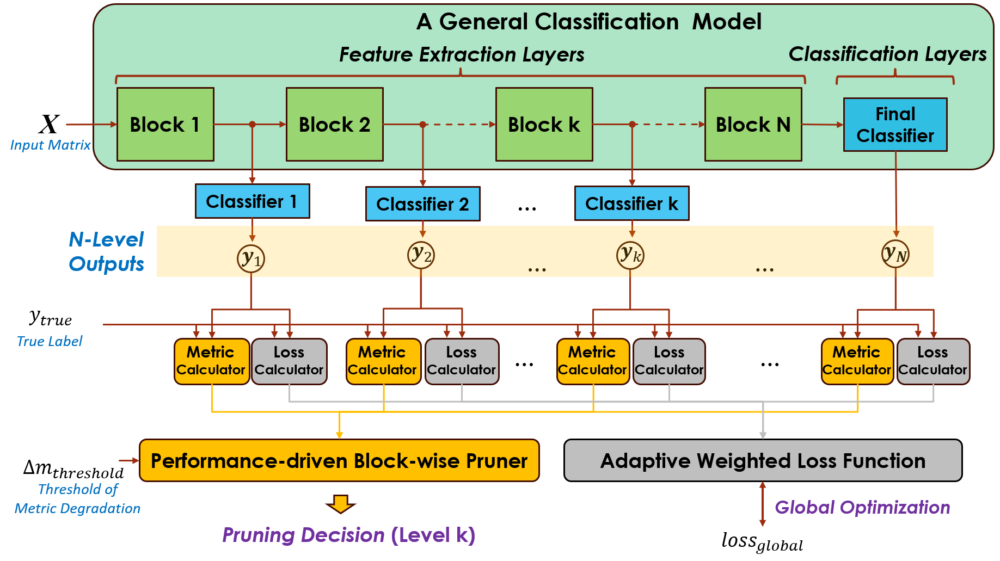

# ADP: Adaptive Depth-wise Pruning

## Overview

**ADP (Adaptive Depth-wise Pruning)** is an adaptive and architecture-agnostic model compression framework specifically designed for ESC (Environmental Sound Classification) tasks. It dynamically partitions models into modular blocks and prunes them based on performance metrics, offering an efficient trade-off between model size and accuracy. 
## Framework: Pregressive Pruning AST with Dataset ESC-50 using ADP


ADP is particularly suitable for tasks with varying resource and accuracy requirements, making it flexible and robust.
## Key Features

- **Architecture-agnostic**: Compatible with diverse model architectures.
- **Dynamic Pruning**: Prunes modular blocks adaptively based on depth-wise performance metrics.
- **Global Optimization**: Jointly trains depth-wise classifiers for enhanced accuracy.
- **ESC-tailored**: Optimized for Environmental Sound Classification tasks.

## Installation

1. Clone the repository:
   ```bash
   git clone git@github.com:yourusername/ADP.git
2. Navigate to the project directory:
   ```bash
   cd ADP
3. Install dependencies:
   ```bash
   pip install -r requirements.txt

## Usage
Training and Pruning
To train a model with ADP and apply depth-wise pruning:
   ```bash
python run-adp.py --mode global --max_epochs 30 --save_threshold 0.94 --num_samples 36


